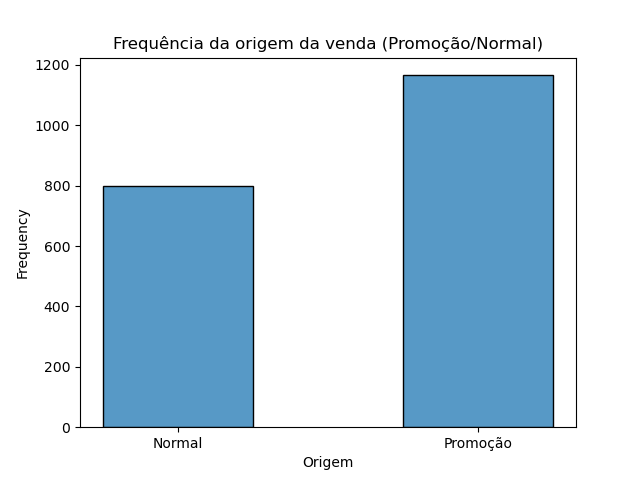

# Descrição do projeto

Uma empresa de varejo fictícia, possui milhares de clientes. Com o objetivo de aumentar o faturamento e o lucro da empresa, a diretoria quer conseguir identificar quem é o cliente ideal para seus produtos, baseado no histórico de compras dos clientes. Para isso, ela fez o trabalho de classificar os clientes com uma nota de 1 a 100. A partir dessa classificação, o perfil do cliente ideal da empresa, deve ser determinado.

As características do cliente ideal, que devem ser definidas de acordo com a empresa, é:
* Idade;
* Profissão;
* Tempo de experiência e;
* Quantidade de pessoas, que compõe a família do cliente.

 # Sumário
 
* [1. Base de dados](##1-Base-de-dados)
* [2. Tratamento de dados](##2-tratamento-de-dados)
* [3. Análise dos dados](##3-análise-dos-idiomas-originais)
* [4. Definição do perfil do cliente ideal](##4-análise-notas)
* [5. Conclusão](##6-conclusao)

 # 1. Base de dados

 A base de dados foi fornecida durante um treinamento, pela empresa Hashtag Programação.
 Canal no Youtube: https://www.youtube.com/@HashtagProgramacao

 Essa base de dados, possui o cadastro de 1965 clientes com os atributos:

| **Atributos** | **Descrição** |
| ------------------- | ------------------- |
| ClienteId | Número de identificação do cliente |
| Origem | Origem da venda (Promoção/Normal) |
| Idade | Idade do cliente |
| Salário Anual (R$) | Salário de um período de um ano do cliente |
| Nota (1 - 100) | Nota atribuída ao cliente, levando em consideração o histórico de compras do cliente |
| Profissão | Profissão do cliente |
| Experiência Trabalho | Tempo de experiência na profissão |
| Tamanho família | Quantidade de pessoas que compõe a família do cliente |

# 2. Tratamento dos dados

Inicialmente, a base de dados continha 2000 registros, porém, 35 delas possuiam dados nulos (NA) na coluna profissão. Como esse atributo é importante na definição do perfil ideal do cliente, optou-se por excluir o registro desses clientes, da base de dados.

# 3. Análise dos dados

O gráfico abaixo apresenta a frequência de vendas n promoção, e vendas normais:  

É possível observar que, vendas em promoção foram mais frequentes em relação as normais. Isso se deve principalmente ao fato, e que com preços menores, a tendência é um aumento no número de vendas. Porém o gráfico abaixo, mostra que a média de notas atribuídas aos clientes pela empresa, é menor para as vendas em promoção:

Uma possível explicação é que, um cliente que realiza uma compra apenas quando há uma promoção, possui uma tendência a comprar em outras lojas, caso haja uma promoção melhor, enquanto um cliente que realiza compras normais, pode apresentar um maior nível de fidelidade a empresa, devido ao fato de não levar em consideração a existência de uma promoção ou não, para efetuar a compra.

# 4. Definição do perfil do cliente ideal

O gráfico abaixo, apresenta a média de notas atribuídas aos clientes pela empresa, em relação a idade:

A menor média de nota, são para clientes abaixo dos 15 anos, o que pode implicar, que a empresa ofereça produtos voltados a adultos. Logo a faixa etária de um cliente ideal é acima de 15 anos.

O proximo gráfico se refere ao salário anual (R$):

A média de nota, levando em consideração o salário anual, apresentou comportamento relativamente próximo, para todas faixas de valor, logo esse atributo, não tem influência no perfil de um cliente ideal.

O gráfico a seguir, apresenta a média de notas em relação a profissão:

Profissionais da área de entretenimento e artistas, apresentaram a maior média de notas, sendo essas, profissões que representam o perfil do cliente ideal. Profissionais da área de construção, possuem a menor média de notas, logo devem ser evitados.

Com relação a experiência de trabalho:

A faixa de tempo de experiência, entre 10 a 15 anos, apresentou a maior média de nota. Acima de 16 anos de tempo de serviço, a pior média. Clientes com 2 anos de experiência, apresentaram uma boa avaliação.

Por fim, o gráfico seguinte, ilustra a influência do número de pessoas, que compõe  família do cliente:

Clientes com até 7 pessoas na família, apresentam uma boa avaliação por parte da empresa, a partir de 8 pessoas, a média de nota cai abruptamente.

# 5. Conclusão

O perfil do cliente ideal é:
* Idade acima dos 15 anos;
* Profissão: Entretenimento ou artista. Evitar profissional da área de construção, pois possuem a menor média de nota entre as profissões analisadas;
* Tempo de experiencia na profissão: de 10 a 15 anos;
* Família com no máximo 7 pessoas.

Com esse perfil, é possível adotar uma estratégia de vendas voltada a um público alvo, que corresponde a essas caracteristicas, o que causará um aumento nas vendas para a empresa, além de estabelecer uma boa relação entre empresa e cliente.
